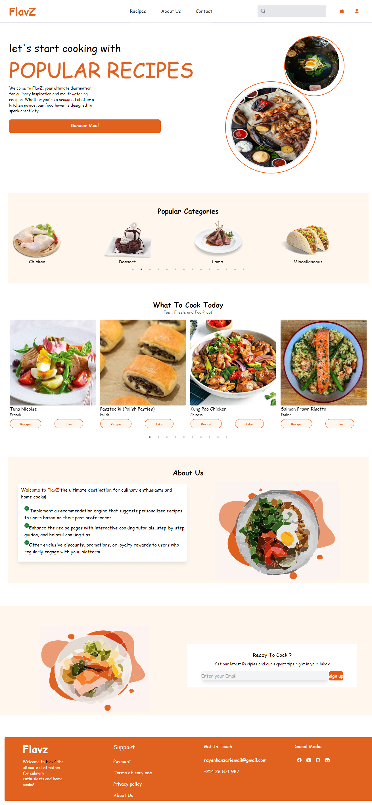
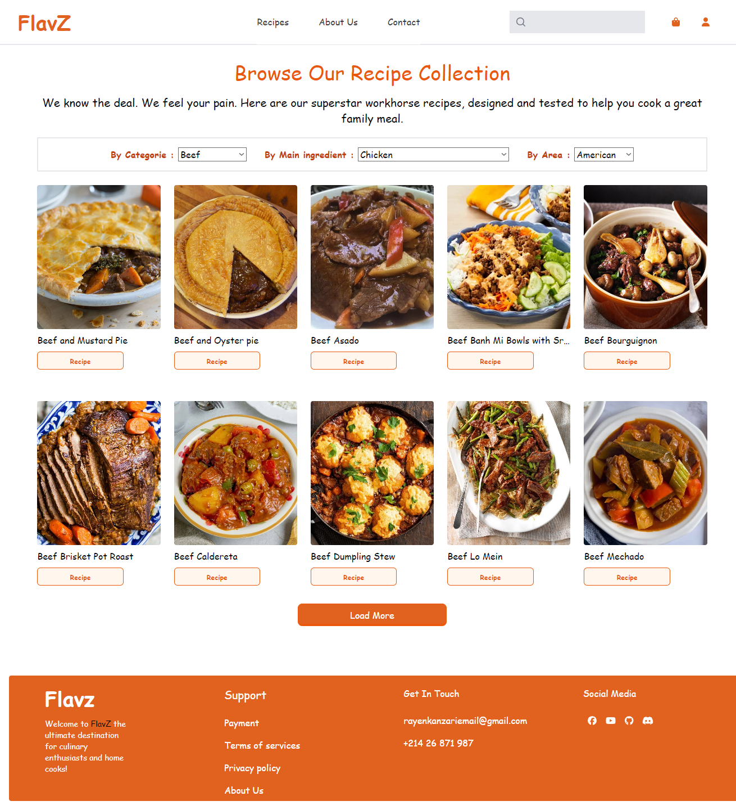
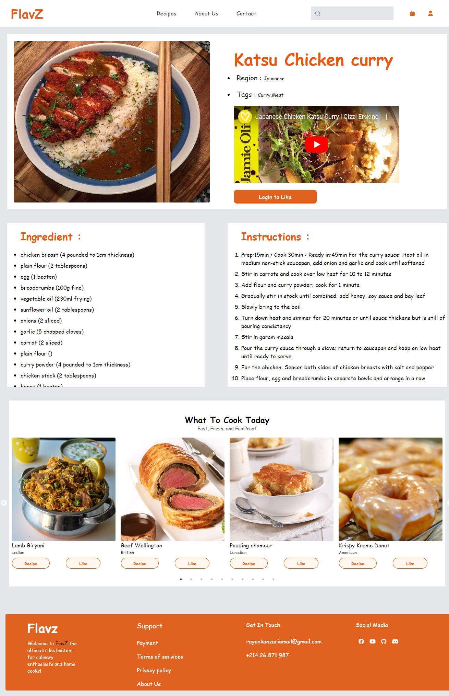
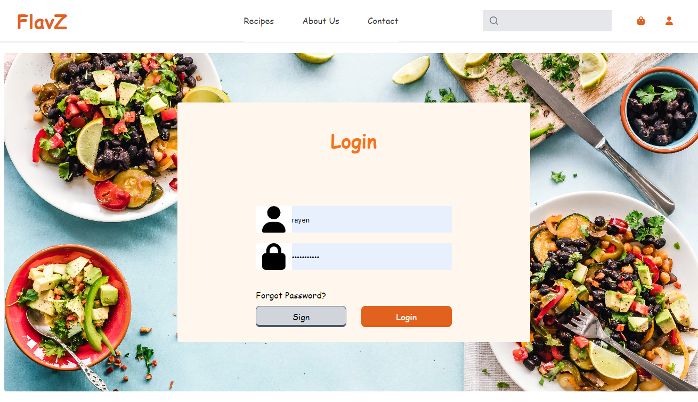
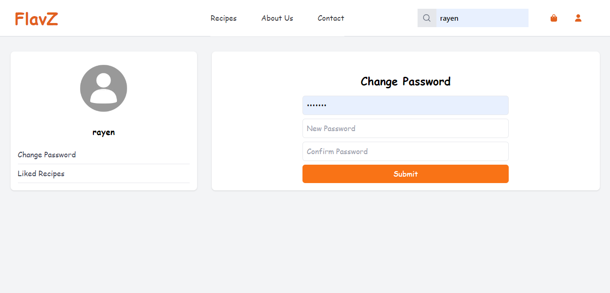
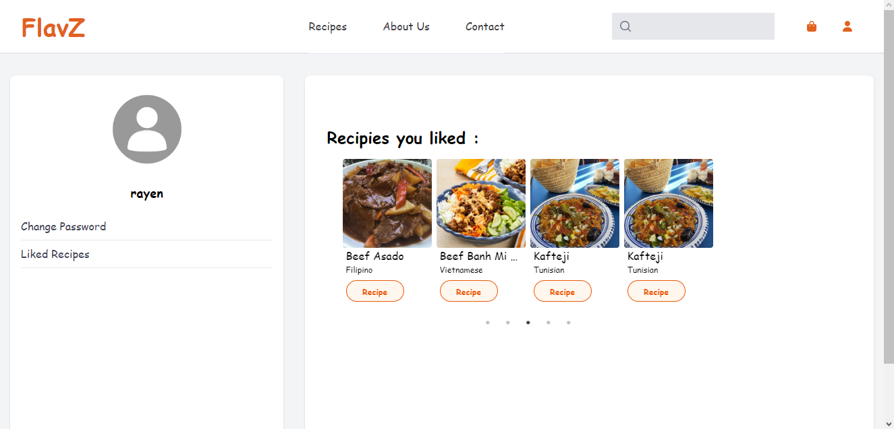

# Flavz Recipe Sharing Website

Flavz is a web application for sharing and discovering recipes. Built with React, Node.js, Express, Tailwind CSS, and MySQL, Flavz allows users to create accounts, search for recipes, save their favorite recipes, and access a database of over 300 recipes. Each recipe includes ingredients, instructions, and other relevant details.

## Demo

Explore the live demo: [Flavz Recipe Sharing](http://your-demo-url.com)

## Features

- User account creation and authentication
- Search for recipes by name, ingredients, or tags
- Save favorite recipes to a private collection
- Access a database of over 300 recipes
- View detailed information for each recipe, including ingredients and instructions

## Screenshots








## Getting Started

To run Flavz locally, follow these steps:

1. Clone the repository:

    ```bash
    git clone https://github.com/Rayenkan/RecipiesSharing.git
    ```

2. Navigate to the project directory:

    ```bash
    cd sharing_recipies
    ```

3. Install dependencies for both the client and server:

    ```bash
    cd client
    npm install
    cd ../server
    npm install
    ```

4. Set up the MySQL database:

    - Create a MySQL database and update the connection settings in `server/config/db.config.js`.

5. Start the server:

    ```bash
    cd backend
    npm start
    ```

6. Start the client:

    ```bash
    cd frontend
    npm start
    ```

7. Open your web browser and go to [http://localhost:3000/](http://localhost:3000/)

## Technologies Used

- React
- Node.js
- Express
- Tailwind CSS
- MySQL

## Authors

- Your Name
  - [GitHub](https://github.com/Rayenkan)
  - [LinkedIn](https://www.linkedin.com/in/rayen-kanzari-b17a52298//)

Feel free to customize and improve the documentation as needed. If you have any questions or need further assistance, don't hesitate to ask!
